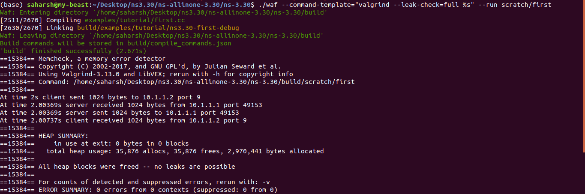
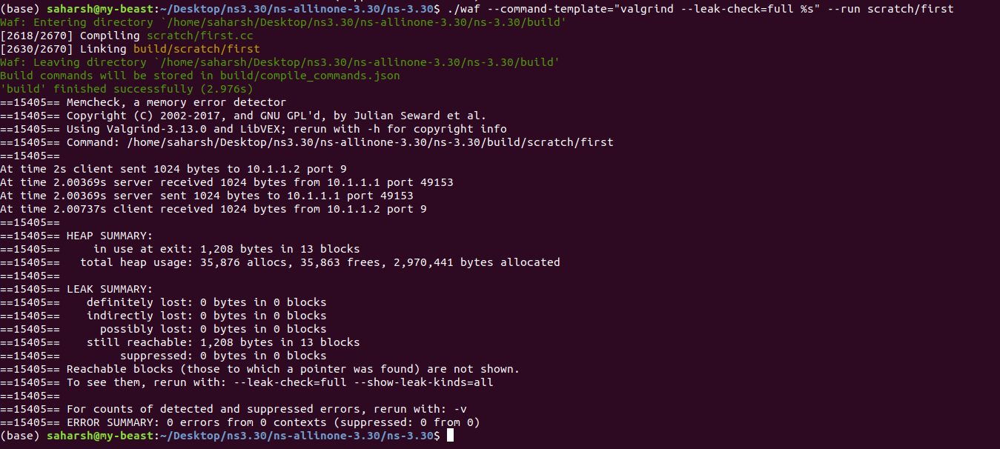

## Use valgrind to understand memory leaks using first.cc

copy first into scratch folder and then 

     ./waf --command-template="valgrind --leak-check=full %s" --run scratch/first

Before removing line 71

 

After removing line 71

 

## Print the data type of the variables in star.cc using gdb (GNU Debugger)

    Copy star.cc from examples/tcp to scratch
    Configure and build ns-3.
    Execute command: ./waf shell
    Execute command: gdb build/scratch/star
    Print the data type of variables: nSpokes and port using ptype

put breakpoint before those lines using and run  
when the program stops then do ptype variable name
    
    b linenum1
    next //n times untill next variable is reached
    run
    ptype variable name

## Modify first.cc to support IPv6 addressing

The file "first.cc" is modified to support IPv6 , do 
    
    ./waf --run "scratch/myfirst_with_V4ndV6 V6"

## Enable support of flow monitor in tcp-bulk-send.cc
The files tcp-bulk-send.cc is the edited file which is monitered.  
and FlowControl.xml file is the output file of the monitering.
You can visualize that file using netanim

## Compare the congestion window plots for TCP Newreno and TCP Highspeed
follow this link--    

the cwnd.png file is the congestion window plot of fifth.cc  using Newreno.

add these lines to switch to TcpHighSpeed

    std::string transport_prot = "TcpHighSpeed";
    CommandLine cmd;
    cmd.AddValue ("transport_prot","Transport protocol to use: TcpHighSpeed, ", transport_prot);

now follow the link
https://codein.withgoogle.com/archive/2018/organization/5152211763986432/task/5911445548040192/

